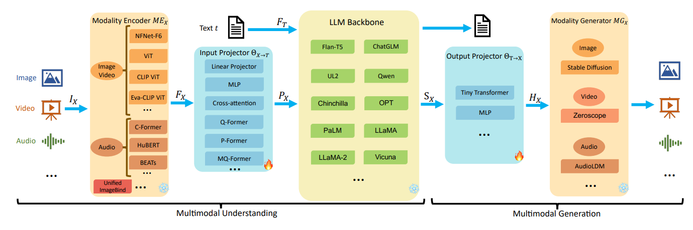

多模态大模型（Multimodal LLMs）可以处理文本、图像、音频等多种模态的信息。广义的多模态模型可以输入多种模态，输出也可以是多种模态，中间以LLM作为核心大脑进行信息处理。本部分关注输入多模态+输出文本的多模态模型。

- 早期多模态大模型（pre-2023）
  -  <a href="/post_html/MLLM/Flamingo.html">多模态大模型 —— Flamingo 精读笔记</a>（2022.04）
  -  <a href="/post_html/MLLM/Blip-2.html">多模态大模型 —— BLIP-2 精读笔记</a>（2023.01）
  -  <a href="/post_html/MLLM/LLaVA.html">多模态大模型 —— LLaVA 精读笔记</a>（2023.04）

- InternVL系列
  - <a href="/post_html/MLLM/InternVL1-0.html">多模态大模型 —— InternVL 1.0 精读笔记</a>（2023.12）
  - <a href="/post_html/MLLM/InternVL1-5.html">多模态大模型 —— InternVL 1.5 & 2.0 精读笔记</a>（2024.04）
  - <a href="/post_html/MLLM/InternVL2-5.html">多模态大模型 —— InternVL 2.5 精读笔记</a>（2024.12）
  - <a href="/post_html/MLLM/InternVL3-0.html">多模态大模型 —— InternVL 3.0 精读笔记</a>（2025.04）
  - <a href="/post_html/MLLM/InternVL3-5.html">多模态大模型 —— InternVL 3.5 精读笔记</a>（2025.08）

- Qwen-VL系列
  - <a href="/post_html/MLLM/Qwen-VL.html">多模态大模型 —— Qwen-VL 精读笔记</a>（2023.08）
  - <a href="/post_html/MLLM/Qwen2-VL.html">多模态大模型 —— Qwen2-VL 精读笔记</a>（2024.09）
  - <a href="/post_html/MLLM/Qwen2.5-VL.html">多模态大模型 —— Qwen2.5-VL 精读笔记</a>（2025.02）
  - <a href="/post_html/MLLM/Qwen3-VL.html">多模态大模型 —— Qwen3-VL 精读笔记</a>（2025.09）
