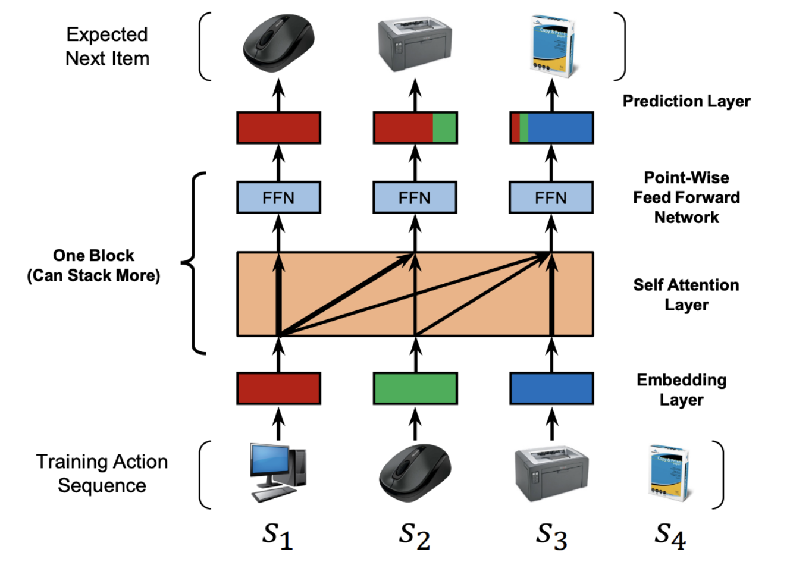

生成式推荐（Generative Recommendation）相关的工作基本都是基于HSTU和TIGER的路线走的，但二者的核心范式和技术实现都存在较大的差异，尤其是HSTU涉及很多传统推荐中的概念，对于没有推荐基础的人来说读起来相当晦涩。本文为结合个人理解的学习笔记，希望能对这几篇工作有更深刻的理解。

### SASRec
> [https://arxiv.org/pdf/1808.09781](https://arxiv.org/pdf/1808.09781)

SASRec是第一个尝试以生成式的方法来召回物品的工作。

SASRec（Self-Attentive Sequential Recommendation，2018）利用Transformer来高效地捕捉完整历史序列中的重要依赖信息。其将用户行为序列视为一个句子来处理，自动学习序列中每个物品与序列中其他物品的相关性，然后基于这些相关性预测用户下一个可能交互的物品。
通过一个Embedding矩阵 $\bold M\in\mathcal R^{|\mathcal I|\times d}$ 将序列$S^u$中的各个物品映射成d维向量，其中$\bold M_{s_i}$表示物品$s_i$的embedding向量。考虑模型的最大输入长度$n$，截取最近的$n$个物品的embeddings，得到输入序列的embedding矩阵$\bold E\in\mathbb R^{n\times d}$，其中$\bold E_i=\bold M_{s_i}$。然后，引入可学习的位置embedding $\bold P\in\mathcal R^{n\times d}$并加到原embedding上，得到最终的序列输入表示$\bold{\hat E}$

